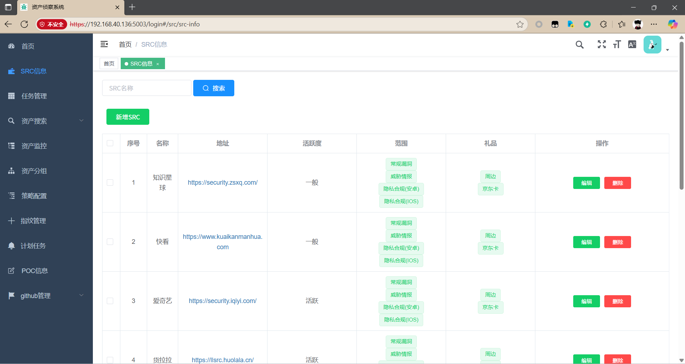
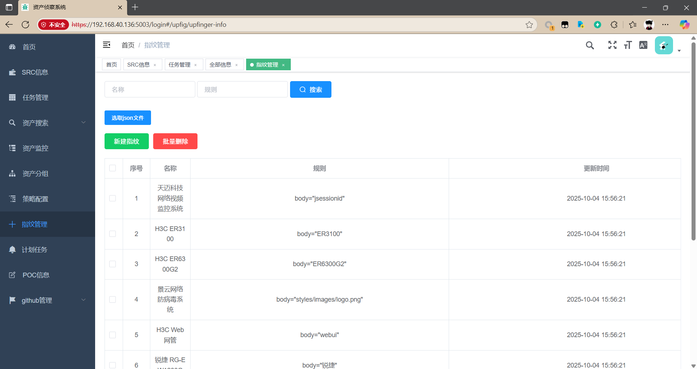
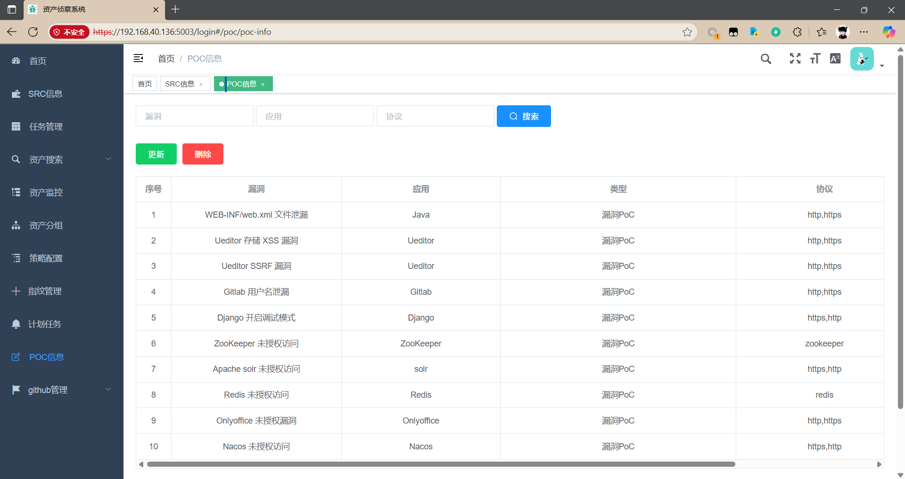
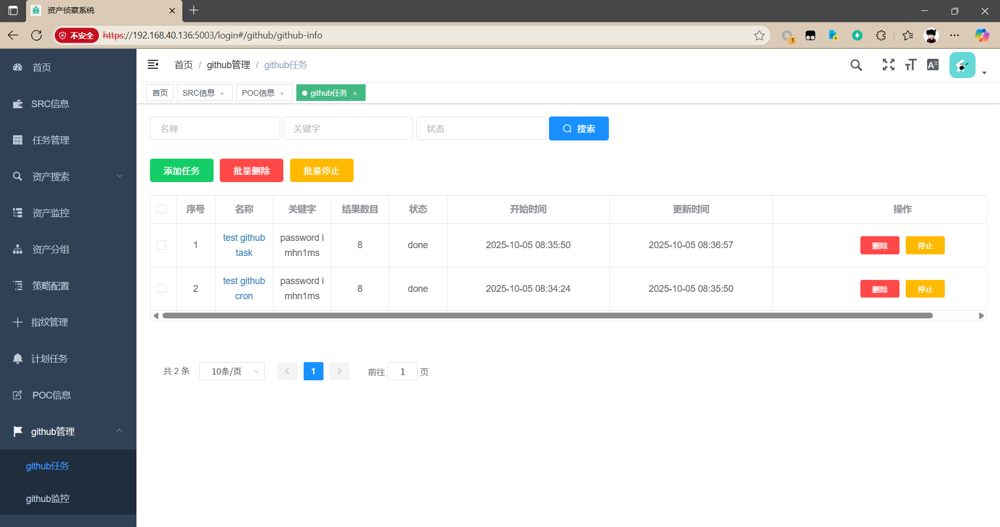

郑重声明：文中所涉及的技术、思路和工具仅供以安全为目的的学习交流使用，任何人不得将其用于非法用途以及盈利等目的，否则后果自行承担。

# 介绍

作者：PYJ

架构：Flask+Vue+Mongodb+RabbitMQ

介绍：基于ARL的二开，在原来的基础上优化一些细节，添加了Oneforall和两款未授权扫描插件FindJsInfo、PackerFuzzer和xray（被动扫描挺好用），因ARL的前端已经打包好，无法再次进行二开，故需要对前端进行完全重构，使用的是vue-element-admin后台模版。功能和ARL无二致，主要是一些功能的增强和细节的优化，总体来说还是蛮吃服务器配置，但是效果相比原来好许多，重构前端后，可随意增加功能插件。

# 前端

# 效果

## 登录

## 主页

显示数据详情

## 个人中心

## SRC

各大SRC厂商的收录准则

## 任务

管理任务，扫描器的入口

## 详情

项目的具体情况，例如子域名数和漏洞等情况

## 指纹

## poc

## 监控

# 致谢

[Aabyss-Team/ARL: ARL官方仓库备份项目：ARL(Asset Reconnaissance Lighthouse)资产侦察灯塔系统旨在快速侦察与目标关联的互联网资产，构建基础资产信息库。 协助甲方安全团队或者渗透测试人员有效侦察和检索资产，发现存在的薄弱点和攻击面。](https://github.com/Aabyss-Team/ARL)

[xinghe0/ARL2: ARL灯塔工具二开以及前端重构](https://github.com/xinghe0/ARL2)

[adysec/ARL: ARL 资产侦察灯塔系统（可运行，添加指纹，提高并发，升级工具及系统，无限制修改版） | ARL(Asset Reconnaissance Lighthouse)资产侦察灯塔系统旨在快速侦察与目标关联的互联网资产，构建基础资产信息库。 协助甲方安全团队或者渗透测试人员有效侦察和检索资产，发现存在的薄弱点和攻击面。](https://github.com/adysec/ARL)

[Aabyss-Team/ARL: ARL官方仓库备份项目：ARL(Asset Reconnaissance Lighthouse)资产侦察灯塔系统旨在快速侦察与目标关联的互联网资产，构建基础资产信息库。 协助甲方安全团队或者渗透测试人员有效侦察和检索资产，发现存在的薄弱点和攻击面。](https://github.com/Aabyss-Team/ARL)

[Aabyss-Team/ARL-NPoC: ARL-Core官方仓库备份项目：集漏洞验证和漏洞利用的一个框架](https://github.com/Aabyss-Team/ARL-NPoC)
